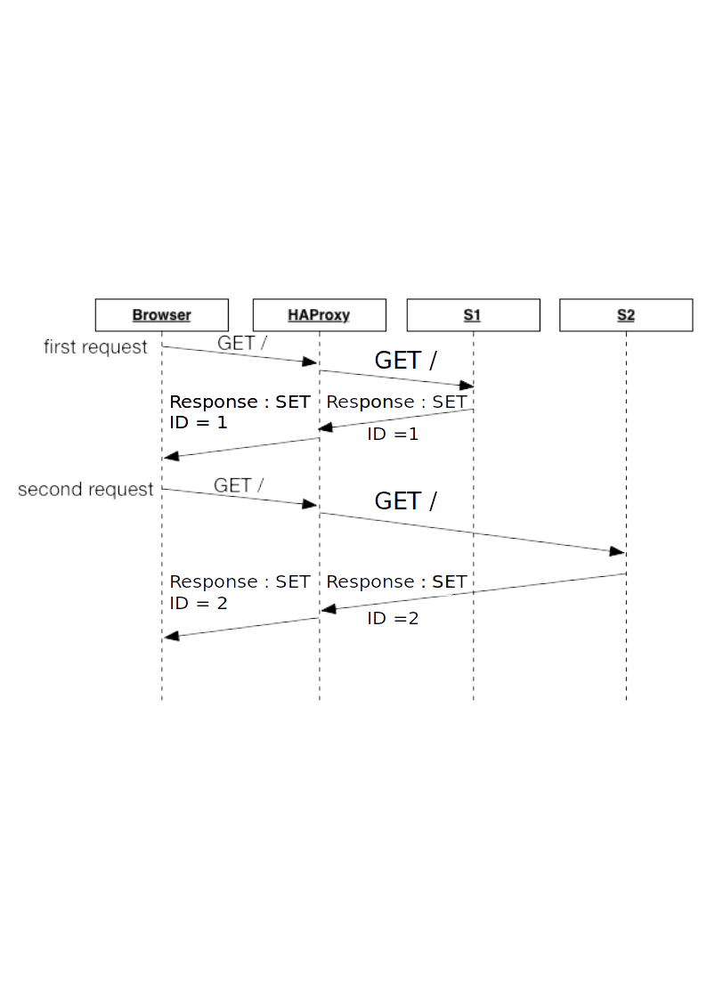

# AIT - Labo 3

# Authors : Adrien Barth, Jeremy Zerbib

## Task 1: Install the tools

**Explain how the load balancer behaves when you open and refresh the URL <http://192.168.42.42> in your browser. Add screenshots to complement your explanations. We expect that you take a deeper a look at session management.**

When we first connect to the URL <http://192.168.42.42>, we can see this page appearing : 


Then, we refresh the page and we see that the page loading is the following : 


The load-balancing is of the type *Round-Robin*. Basically, what is happening is that the proxy is redirecting the client once on one server, once on the other. We can see that happening because of the change of the `tag`, the `host`, the `ip` and the `id` fields. 

The basic functionality of a Round-Robin is explained below : 

 

The proxy creates a queue with the servers lined up. It goes from one server to another and queues the used server back to its original spot.

**Explain what should be the correct behavior of the load balancer for session management.**

The correct behavior for the session management would be to keep a given client connected to a server. It should be obvious that a client wants to keep his session opened while reloading a page. For example, if a clients aims to keep his number of connection to a server accurate, he might want to be connected every time to the same server.

**Provide a sequence diagram to explain what is happening when one requests the URL for the first time and then refreshes the page. We want to see what is happening with the cookie. We want to see the sequence of messages exchanged (1) between the browser and HAProxy and (2) between HAProxy and the nodes S1 and S2. Here is an example:** 


As the proxy runs a *Round-Robin* configuration, the communications go like this  : 



We can see that the balancing operates in a way that during the first request, the client goes to the server *S1* and sets up an ID for each request to the client. The client stores the token ID but the server does not know what to do with it, so it applies its *Round-Robin* queue algorithm. 

Therefore, the client is redirected to the server *S2* and as the server does not know what to do with the ID token, it will set up a new ID.

This mechanism will go on as long as we keep refreshing the page. We can see that ID is never the same. 

**Provide a screenshot of the summary report from JMeter.**


**Run the following command:**

```
$ docker stop s1
```

**Clear the results in JMeter and re-run the test plan. Explain what is happening when only one node remains active. Provide another sequence diagram using the same model as the previous one.**


Basically, what is happening is that the client tries to get to *S1*. As S1 is not available, it goes to *S2* one time out of two. We can see we try to `GET` 2000 times but get a hit only half of those tries.  The ID stays the same throughout the test because the server knows the first ID and therefore no need to create a new one. An user can potentially keep his session alive.

The sequence diagram shows what we is happening.


## Task 2: Sticky sessions

**There is different way to implement the sticky session. One  possibility is to use the SERVERID provided by HAProxy. Another way is  to use the NODESESSID provided by the application. Briefly explain the  difference between both approaches (provide a sequence diagram with  cookies to show the difference).**

- **Choose one of the both stickiness approach for the next tasks.**

The difference between the *SERVERID* and the *NODESESSID* methors lives in the fact that the first is on a server side and the latter is on the client's side.  The cookie is produced by the proxy in the *SERVERID*'s case and on client's side for the *NODESESSID*.

In the first case, the proxy will produce the *ID* and sticks to the packet. This will allow the tracking of the session throughout the transmissions.

In the last case, the proxy will use the cookie that the client produces and sticks a prefix to it, which will be cleaned prior to transmitting the request to the server.


**Provide the modified `haproxy.cfg` file with a short explanation of the modifications you did to enable sticky session management.**


**Explain what is the behavior when you open and refresh the URL http://192.168.42.42 in your browser. Add screenshots to complement your explanations. We expect that you take a deeper a look at session management.**


**Provide a sequence diagram to explain what is happening when one requests the URL for the first time and then refreshes the page. We want to see what is happening with the cookie. We want to see the sequence of messages exchanged (1) between the browser and HAProxy and (2) between HAProxy and the nodes S1 and S2. We also want to see what is happening when a second browser is used.**


**Provide a screenshot of JMeter's summary report. Is there a difference with this run and the run of Task 1?**

- **Clear the results in JMeter.**
- **Now, update the JMeter script. Go in the HTTP Cookie Manager and ~~uncheck~~verify that the box `Clear cookies each iteration?` is unchecked.**
- **Go in `Thread Group` and update the `Number of threads`. Set the value to 2.**


**Provide a screenshot of JMeter's summary report. Give a short explanation of what the load balancer is doing.**

