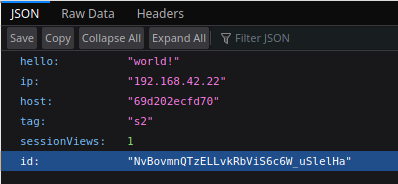
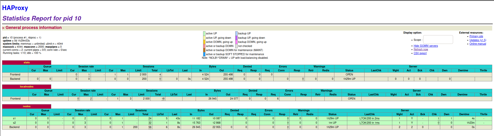
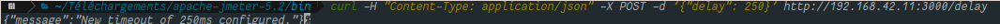

# AIT - Labo 3

# Authors : Adrien Barth, Jeremy Zerbib

## Task 1: Install the tools

**Explain how the load balancer behaves when you open and refresh the URL <http://192.168.42.42> in your browser. Add screenshots to complement your explanations. We expect that you take a deeper a look at session management.**

When we first connect to the URL <http://192.168.42.42>, we can see this page appearing : 


Then, we refresh the page and we see that the page loading is the following : 


The load-balancing is of the type *Round-Robin*. Basically, what is happening is that the proxy is redirecting the client once on one server, once on the other. We can see that happening because of the change of the `tag`, the `host`, the `ip` and the `id` fields. 

The basic functionality of a Round-Robin is explained below : 

 

The proxy creates a queue with the servers lined up. It goes from one server to another and queues the used server back to its original spot.

**Explain what should be the correct behavior of the load balancer for session management.**

The correct behavior for the session management would be to keep a given client connected to a server. It should be obvious that a client wants to keep his session opened while reloading a page. For example, if a clients aims to keep his number of connection to a server accurate, he might want to be connected every time to the same server.

**Provide a sequence diagram to explain what is happening when one requests the URL for the first time and then refreshes the page. We want to see what is happening with the cookie. We want to see the sequence of messages exchanged (1) between the browser and HAProxy and (2) between HAProxy and the nodes S1 and S2. Here is an example:** 


As the proxy runs a *Round-Robin* configuration, the communications go like this  : 


We can see that the balancing operates in a way that during the first request, the client goes to the server *S1* and sets up an ID for each request to the client. The client stores the token ID but the server does not know what to do with it, so it applies its *Round-Robin* queue algorithm. 

Therefore, the client is redirected to the server *S2* and as the server does not know what to do with the ID token, it will set up a new ID.

This mechanism will go on as long as we keep refreshing the page. We can see that ID is never the same. 

**Provide a screenshot of the summary report from JMeter.**


**Run the following command:**

```
$ docker stop s1
```

**Clear the results in JMeter and re-run the test plan. Explain what is happening when only one node remains active. Provide another sequence diagram using the same model as the previous one.**


Basically, what is happening is that the client tries to get to *S1*. As S1 is not available, it goes to *S2* one time out of two. We can see we try to `GET` 2000 times but get a hit only half of those tries.  The ID stays the same throughout the test because the server knows the first ID and therefore no need to create a new one. An user can potentially keep his session alive.

The sequence diagram shows what we is happening.


## Task 2: Sticky sessions

**There is different way to implement the sticky session. One  possibility is to use the SERVERID provided by HAProxy. Another way is  to use the NODESESSID provided by the application. Briefly explain the  difference between both approaches (provide a sequence diagram with  cookies to show the difference).**

- **Choose one of the both stickiness approach for the next tasks.**

The difference between the *SERVERID* and the *NODESESSID* methods lives in the fact that the first is on a proxy side and the latter is on the client's side.  Indeed, the cookie we want to create, is produced by the proxy in the *SERVERID*'s case and on client's side for the *NODESESSID*.

In the first case, the proxy will produce the *ID* and sticks to the packet, called SERVERID, only if the user did not start communicating with such cookie.

In the last case, the proxy will use the cookie that the client produces and sticks a prefix to it, which will be cleaned prior to transmitting the request to the server.

- SERVERID


- NODESESSID


`For the remaining of this task, we will be using the *SERVERID* stickiness method.`

**Provide the modified `haproxy.cfg` file with a short explanation of the modifications you did to enable sticky session management.**

You can see [here](https://www.haproxy.com/blog/load-balancing-affinity-persistence-sticky-sessions-what-you-need-to-know/) how we got the configuration file edited in order to set up the configuration file that produces the cookie server side.  

To summarize everything, here is how we do it. 

We must edit the configuration file located in : `ha/config/haproxy.cfg`. 

After the `backend nodes` label, right after the line `option forwardfor`,  we added this line `cookie SERVERID insert indirect nocache`.

Then, we added at the end of the line `server s1 ${WEBAPP_1_IP}:3000 check`  `cookie s1` and the same for `s2`. 

What it does is basically adding a *cookie* named *SERVERID* if it does not exist. Then while connecting to the server, the load-balancer will check if there is a cookie available for the session.

If there is, then nothing is created and the server follows the session.

If there isn't a cookie setup, then the proxy will create a cookie and create a new session.

The modified file, `haproxy.cfg`, is located in the `ha` folder under the same name.

**Explain what is the behavior when you open and refresh the URL http://192.168.42.42 in your browser. Add screenshots to complement your explanations. We expect that you take a deeper a look at session management.**

After editing the configuration file, we can see the expected behavior through those screenshots : 




We can see here that the first time we sent the request, `sessionview` has a value of 1, that we receive only the `NODESESSID` cookie. 


We can also see that we send the new cookie, `SERVERID` with the request. The value is set to *S2* as we started on the server *S2* at the beginning of our request.

After reloading the page, we get this : 


The cookie received is the following : 


We see that the session ID is saved thanks to the `SERVERID`. 

The session can stick if I do not change the user doing the request.

**Provide a sequence diagram to explain what is happening when one requests the URL for the first time and then refreshes the page. We want to see what is happening with the cookie. We want to see the sequence of messages exchanged (1) between the browser and HAProxy and (2) between HAProxy and the nodes S1 and S2. We also want to see what is happening when a second browser is used.**


For this part we can see the exchange between all the parts of the circuit in the sequence diagram above. 

When a user uses a second browser, what happens is the following : 

- First the user connect to *S1* on the first browser.
- The proxy goes to the first server in the *Round-Robin* queue. (*S1* in our case)
- The server responds with the *NodeSessionID* appropriate for the session.
- The proxy creates a new cookie, *SERVERID*, and sticks it to the session.
- While the user connects from the same browser, the session will stick.
- If the user opens a new browser, or a private navigation window on the same browser, the session will change.

**Provide a screenshot of JMeter's summary report. Is there a difference with this run and the run of Task 1?**


There is a difference between this situation and the one in *Task 1*.  It lies in the fact that only on server is reached in this situation because of the cookie we set. The proxy makes sure that the session sticks throughout the thread's life. That's the reason why we never reach the *S1* server.

- **Clear the results in JMeter.**
- **Now, update the JMeter script. Go in the HTTP Cookie Manager and ~~uncheck~~verify that the box `Clear cookies each iteration?` is unchecked.**
- **Go in `Thread Group` and update the `Number of threads`. Set the value to 2.**

**Provide a screenshot of JMeter's summary report. Give a short explanation of what the load balancer is doing.**


The load balancer is doing its job, by the looks of it.

We can that the first request is reaching the *S2* server first then the second thread is redirected to *S1*. The *Round-Robin* algorithm is doing what it is supposed to do and the load is equally balanced between the two servers.

## Task 3 : Drain mode

**Take a screenshot of the Step 5 and tell us which node is answering.**


Given the info on the browser, the node *S2* is reached every time and we can see that, given the cookie we set up prior to this task, that we stay in this node.


**Based on your previous answer, set the node in DRAIN mode. Take a screenshot of the HAProxy state page.**


We can see that we are in `drain` mode on the *S2* node.

**Refresh your browser and explain what is happening. Tell us if you stay on the same node or not. If yes, why? If no, why?**


After a few refresh, we can see that we stayed on the same node. The fact that we put the `Drain` mode on means that we are blocking any connection on another server but any user can establish a new session on this server. It blocks any load balancing but still allow any health-checks or a new persistent connection. (cf. slides from the course on `High performance systems` slide 40).

**Open another browser and open `http://192.168.42.42`. What is happening?**

We are going to the other server, *S1*.


**Clear the cookies on the new browser and repeat these two steps multiple times. What is happening? Are you reaching the node in DRAIN mode?**


After multiple tries, we can see that we are always reaching the node *S1*, the on that is not on `DRAIN` mode, and we cannot reach the drained node. We can see that the session ids are different every time. The server has no way of knowing that the user is the same so that's why it assigns a new ID every time.

**Reset the node in READY mode. Repeat the three previous steps and explain what is happening. Provide a screenshot of HAProxy's stats page.**



The node is reset to `READY`which means normal mode according to the slides on `High performance systems` slide 40 from the course material. 

Therefore, the behavior is the one we expected.

First, we connect to a node, *S2* in our case, and if refresh the page a few times, we stay on it, thanks to the cookie set up in task 2.


Then, we open another browser and go to the *S1* node.


We can see that we are redirected to the other node, as a normal *Round-Robin* algorithm would do. But we might need something more to convince you.

So we open a third browser and connect to server.


We see that we are redirected to *S2*.

**Finally, set the node in MAINT mode. Redo the three same steps and explain what is happening. Provide a screenshot of HAProxy's stats page.**


We can see in the above screenshot that the *S2* node is set up in `MAINT` mode and below that when we connect to the server, it cannot reach the *S2*  node.


Even when we try on another browser.


We can see a different ID but accessing the same server.

## Task 4 : Round robin in degraded mode.

***Remark*: Make sure you have the cookies are kept between two requests.**

**Be sure the delay is of 0 milliseconds is set on `s1`. Do a run to have base data to compare with the next experiments.**


**Set a delay of 250 milliseconds on `s1`. Relaunch a run with the JMeter script and explain what it is happening?**



After increasing the delay between each answer on *S1*, we can see that it takes a significant amount of time to finish the requests, as on *S2*  the time seems to be almost the same.


**Set a delay of 2500 milliseconds on `s1`. Same than previous step.**


The *S1* node is not even attained by the users because of the timeout. Therefore, only *S2*  is shown in the result.


**In the two previous steps, are there any error? Why?**

`JMeter` does not prompt any error. 

**Update the HAProxy configuration to add a weight to your nodes. For that, add `weight [1-256]` where the value of weight is between the two values (inclusive). Set `s1` to 2 and `s2` to 1. Redo a run with 250ms delay.**

**Now, what happened when the cookies are cleared between each requests and the delay is set to 250ms ? We expect just one or two sentence to  summarize your observations of the behavior with/without cookies.**


## Task 5 : Balancing strategies

**Briefly explain the strategies you have chosen and why you have chosen them.**

The two strategies we chose are : 

- `static-rr`
- `leastconn`

We chose those two strategies because : 

-  `static-rr` is almost the same as the one we saw during this lab and we wanted to know what the difference might be with the one 

**Provide evidences that you have played with the two strategies (configuration done, screenshots, ...)**

**Compare the both strategies and conclude which is the best for this lab (not necessary the best at all).**